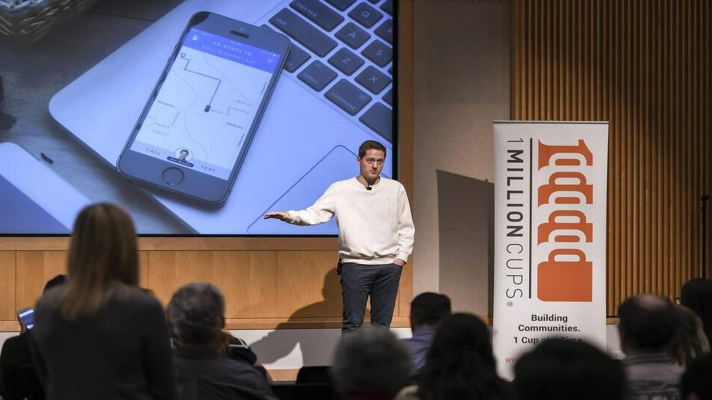

*   With “Hot DAO Summer” rapidly coming to a close, I felt compelled to write about one of my favorite organization's possible path to be[**_coming a decentralized super saiyan version of itself. While most_**](https://google.com) of the tooling outlined here pertains to blockchains, I tried to leave out as much technical jargon as possible to help align on common goals rather than dictating specific solutions.
    

## What is 1 Million Cups?

1 Million Cups (1MC) is an amazing organization initially organized at the excellent foundation created by Ewing Kauffman in Kansas City, MO that has spread to 100+ cities across the US. Founders, entrepreneurs, and small business owners gather each week to listen to a new founder present about their busi**ness and provide feedback for the idea, pitch, and go to ma**rket strategy. With this feedback, the entrepreneurs are with tangible feedback and new potential connections to build a stronger business with their community.

When 1MC started in a Kansas City conference room to bring together the entrepreneurs that were already working it made sense to have the organization controlled and overseen by the \[Kauffman\] Foundation. As the organization has grown to cities across the country there has been a need to scale the hierarchy by adding regional reps and develop tools to allow the volunteers running local chapters to succeed. But product development costs are high and there's tons of competing priorities for very limited resources.

The Foundation (and the team leading the core organization) have been an absolute godsend, and scaling from a single city to reproducible playbooks across the country is nothing short of extraodinary. As an operational mind and systems thinker, I cannot appreciate this enough. At last, it's time to decentralize and distribute the power from a core operating unit to all stakeholders in the organization being empowered to contribute and grow the org in the best ways for all stakeholders.

## Why distribute?

When building an organization with a volunteer workforce there's a difficult incentive to keep (literally the most valuable) resources and minimize brain drain. Tooling is useful to help transitioning teams get up to speed quickly, but the core knowledge is developed over time and usually requires some hands on training, hence the 1MC Organizer Summit.

This is a great chance for new organizers to familiarize themselves with the workings of other organizers, but it's only a snapshot and difficult for more than a minority of organizers to attend so it can take several years to get a whole team thoroughly trained. (The most recent (2020) online summit being a notable exception.)

The 1MC organizer dashboard also aggregates new submissions and coordinates scheduling for organizers and potential presenters. This is a powerful tool, but the quirks that have been developed (and worked around) over time contribute to organizer fatigue and discourage new organizers from fully submersing into an unpaid position. When participants are stakeholders and can influence the direction of the organization, they feel much more ownership over how they can help other participants.

This can lead to a fragmentation of some parts of the process, but the unification under the 1MC brand and as a stakeholder to maintain that brand the incentives trend toward unified tooling and processes. We need to expose this incentive to 1MC participants and organizers. And we have the (early versions of) tools to do it now!

## What is a DAO?

A DAO, or decentralized autonomous organization, is a collection of members or token holders that govern via smart contract voting. Participants can tribute funds or request a payment for contributions made for the DAO. Treasury is managed via voting on proposals and participants can earn skin in the organization with voting or non-voting membership shares.

This allows organizations to form with sub-organizations collecting with smaller teams that focus on different aspects of delivering. Within Raid Guild, a web/app development agency DAO, there are individual teams spun up for each client project who tribute a portion of the revenue back to the larger collective.

Within other orgs, teams will form naturally around product/development, community management, token engineering, and operations. These teams also overlap and report progress to the others on a regular cadence. The teams are still self-organized with minimal explicit leader while natural leaders are empowered to pick up where they (and others) see a need. The flat organization this produces is empowering at a stakeholder level. Buy-in and spontaneous development are a sweet, sweet combo. Open source development can spark both of these. Of course the opposite has been true in open source software, for a while.

Blockchain projects are almost inherently open source so users can be confident in leaving their funds secured by decentralized applications. The value prop of supporting development for open software remains within the community that 1MC has already built. It's not only possible, but can be done while empowering the community and expanding stakeholders to those contributing in more intangible ways.

## How?

How, you might ask, would a 1 Million Cups DAO even work?

I take these words with action that the participants at 1MC are being left powerless in an org they want to contribute to. Empowering all stakeholders will increase buy-in for new and existing organizers, improve outcomes for entrepreneurs, and contribute to 1MC becoming an anchor in every economic development discussion in every mid-major city across the US.

Different organizations are exploring this to give their community ownership of the value created while participating. I see 3 major steps to decentralizing 1 Million Cups to be owned and operated by it's community rather than steered by a small committee

### 1\. Open source tooling

Using open source technologies or technologies that are easily shareable, in lieu, help empower the community to provide feedback and submit improvements with meaningful intent. Receiving a bunch of unprioritized initiatives makes it just a bit more difficult to make progress toward improving the underlying tools. While this can be done with a small, well-incentivized team this also severely limits the potential contributors that can submit smaller contributions.

Not all tools will be open source at first, but allowing the community to explore which can be replaced provides opportunity to select the best tools for the current decision. The ownership in this decision and the power to adjust will greatly drive adoption of organization wide tools.

### 2\. Distribute ownership to attendees, presenters, previous and current organizers

A community is nothing without the people grinding behind the scenes to build and put on events with consistency and enthusiasm. Rewarding organizers that have been contributors (not too heavily) since the beginning might re-engage them to mentor/contribute again in the future. Additionally, rewarding current organizers will help retain the talent, culture, and knowledge pool that's been curated over the years.

Giving presenters a tiny bit of ownership will incentivize them to return the mentorship when they achieve small successes in their organization. These quickly become carrots for doing real participatory actions within the organization. Even community members attending can earn participatory rewards that verify their attendance which can accumulate value and be displayed within supported social networks/ecosystems. Small incentivizes will drive community members and sponsors to advocate for 1MC at other events throuout the community, not just organizers.

### 3\. Bootstrap initial DAO & seed communities

There are several options to accomplish initial bootstrapping so I'll leave this short. Raising funds for a primary treasury will allow these new owners to bootstrap a self-sufficient community gonverning itself. Providing some operations resources that would receive early salaries (from the DAO) to drive initiatives forward the early community alignment goals will expedite the community bootstrapping phase.

From here the DAO can request for quotes on different aspects of logistics to various service providers when necessary. Rewarding individual contributors can be done through (city based) sub-daos and organizers can improve processes and tooling while earning ownership.

This would also include any intellectual property currently owned by the Foundation being transitioned to the DAO itself. The members would then have the right and responsibility to prosecute any infringements of the IP going forward.

But doesn't this mess up the volunteering incentives for organizers?

No way! There's still intrinsic motivations to organize and the connecting will not be lost in the process. Being able to unify stakeholders will drive retained engagement up causing less organizer fatigue and brain drain.

When organizers are bought into the long term success of the organization they're internal incentives will drive contributions far beyond the monetary compensation we'll provide while still being fulfilling.

## 1MC DAO of DAOs

The already city based nature of 1MC makes it a good fit for a DAO of DAOs structure where many DAOs have ownership in an overarching DAO. Currently delegates make voting in a DAO of DAOs simple and there are options for more liquid democracy like solutions in the works.

New members would be added to sub DAOs and become owners through their contributions within their community DAO. Entrepreneurs would earn stake in the many different communities they visit while organizers go deeper in their own community/DAO.

Additionally, this could be done with regional DAOs, but I think the extra hierarchy complicates things to begin with.

## Self-organized 1MC Organizers Summit

An immediate transition to a fully decentralized organizing community for 1MC organizer summit is likely a steep ask, but there’s a significant incentive to release it from the foundation team so others can build on the awesome precedent that's been set. The regional reps participation in the summit highlights some parts that could be distributed to the edge teams who bring it back to the larger group. This transition can be coordinated over a couple years as the Foundation facilitates the progressive decentralization and eventually cedes it's direct involvement.

Like most conferences, (very) selectively allowing sponsors to provide (limited) advertisements for organizers could provide the necessary funding to allow a nearly independent summit council to focus on its logistics.

## A note about memes

A community is built and dies with its memes. Sharing humor and variations of works without offending the initial idea is a powerful way to share stories of human nature. While it's understandable that the Foundation has a desire to ensure the brand is not abused, empowering a community to be creative with brand assets establishes a trust and reputation in the underlying brand, not tarnishing it (within reason, of course, the IP still needs to be protected to some extent).

## Sustainability

As the national brand for 1MC continues to grow with incentivized members/communities, the community can establish more national sponsors/partnerships for sustaining the continued development and support of organizers. Growing the entrepreneur base is a goal of basically every economic development council across the nation. They'll be heavily invested in growing and facilitating the growth of the entrepreneurial community through 1MC.

Individual stakeholders who've established a reputation and had success can re-invest with increased ownership over that reputation. With the appropriate jurisdiction establishment, the organization could make it enticing for others to charitably give for the caffeinated cause.

## What next?

Blockchains are completely flipping how entrepreneurs and community organizers can trust each other build together with aligned incentives. Let's approach these innovative ideas with the entrepreneurial spirit that got 1MC here.